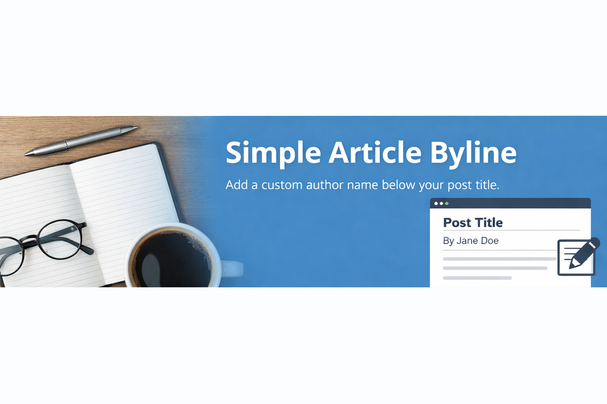

# Simple Article Byline

Simple Article Byline is a lightweight WordPress plugin that allows editors to add a custom article author name displayed directly below the post title.

It is designed for newsrooms, editorial teams, and blogs that need proper byline attribution without replacing the default WordPress author system.

---

## ✨ Features

- Add a custom article author name per post
- Displays the byline **below the post title**, not inside article content
- Clean separation from the article body (no drop caps or intro styling issues)
- Simple post editor meta box
- Lightweight — no settings page, no JavaScript, no dependencies
- Fully compatible with newsroom-style themes
- Translation-ready

---

## 🖥 How It Works

1. Edit or create a post
2. Enter the author name in the **Article Author Name** meta box
3. Publish or update the post
4. The byline appears automatically below the post title on the frontend

---

## 📸 Screenshots

1. Article Author Name meta box in the post editor  
2. Byline displayed below the post title on the frontend

---

## 🔧 Installation

### Manual Installation
1. Download the plugin ZIP file
2. Upload the `simple-article-byline` folder to `/wp-content/plugins/`
3. Activate the plugin from the **Plugins** menu in WordPress

### From WordPress Admin
1. Go to **Plugins → Add New**
2. Upload the plugin ZIP file
3. Activate the plugin

---

## ⚙️ Usage

- Open any post in the WordPress editor
- Enter the desired author name (e.g. *ESE AMADASUN*)
- Leave the field empty if you don’t want a byline for that post

---

